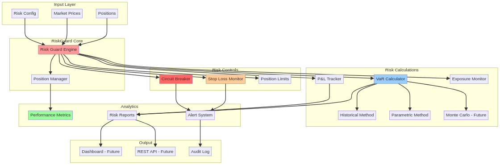
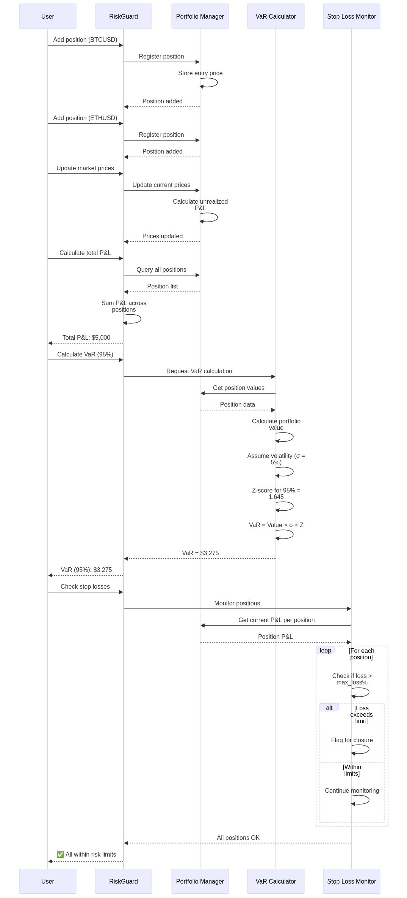

# 🛡️ RiskGuard - Advanced Risk Management System

[](https://www.rust-lang.org/)
[](./LICENSE)

[English](#english) | [Português](#português)

---

## English

### 🚀 Overview

**RiskGuard** is an advanced risk management system for trading operations built in Rust. It provides real-time portfolio monitoring, VaR calculations, position sizing, and automated risk controls.


### ✨ Key Features

- **Value at Risk (VaR)**: Historical, parametric, and Monte Carlo methods
- **Position Sizing**: Dynamic sizing with Kelly Criterion
- **Stop Loss Management**: Automatic stop loss monitoring and alerts
- **Portfolio Analytics**: Real-time P&L tracking and exposure monitoring
- **Circuit Breakers**: Automated trading halts on risk threshold breaches
- **Stress Testing**: Scenario analysis and correlation tracking


### 🏗️ Architecture



The system implements comprehensive risk management:

1. **Input Layer**: Positions, prices, and risk configuration
2. **Core Engine**: Position management and risk calculations
3. **Risk Calculations**: VaR, P&L tracking, exposure monitoring
4. **Risk Controls**: Stop loss, circuit breakers, position limits
5. **Analytics**: Performance metrics and risk reports

### 📉 VaR Calculation Flow



### 🛠️ Installation

```bash
git clone https://github.com/gabriellafis/riskguard.git
cd riskguard
cargo build --release
```

### 🎯 Quick Start

```bash
cargo run --release
```

Output:
```
🛡️  RiskGuard - Advanced Risk Management System
===============================================

📊 Portfolio Analysis:

  BTCUSD:
    Quantity: 10
    Entry: $50000.00
    Current: $51000.00
    P&L: $10000.00 (2.00%)

  ETHUSD:
    Quantity: 50
    Entry: $3000.00
    Current: $2900.00
    P&L: $-5000.00 (-3.33%)

💰 Total P&L: $5000.00
📉 VaR (95%): $3275.00

✅ All positions within risk limits
```

### 📚 Usage Examples

```rust
use riskguard::{RiskGuard, Position};

fn main() {
    let mut guard = RiskGuard::new(100.0, 5.0);

    // Add position
    let position = Position {
        symbol: "BTCUSD".to_string(),
        quantity: 10.0,
        entry_price: 50000.0,
        current_price: 51000.0,
    };

    guard.add_position(position).unwrap();

    // Check P&L
    let total_pnl = guard.total_pnl();
    println!("Total P&L: ${}", total_pnl);

    // Calculate VaR
    let var = guard.calculate_var(0.95);
    println!("VaR (95%): ${}", var);

    // Check stop losses
    let triggered = guard.check_stop_loss();
    if !triggered.is_empty() {
        println!("Stop loss triggered: {:?}", triggered);
    }
}
```

### 📄 License

MIT License - see [LICENSE](LICENSE) for details.

### 👤 Author

**Gabriel Demetrios Lafis**
- Systems Analyst & Developer
- IT Manager
- Cybersecurity Specialist
- Business Intelligence / Business Analyst
- Data Analyst & Data Scientist

---

## Português

### 🚀 Visão Geral

**RiskGuard** é um sistema avançado de gestão de risco para operações de trading construído em Rust. Fornece monitoramento de portfólio em tempo real, cálculos de VaR, dimensionamento de posições e controles de risco automatizados.

### ✨ Principais Recursos

- **Value at Risk (VaR)**: Métodos histórico, paramétrico e Monte Carlo
- **Dimensionamento de Posição**: Dimensionamento dinâmico com Critério de Kelly
- **Gestão de Stop Loss**: Monitoramento automático de stop loss e alertas
- **Analytics de Portfólio**: Rastreamento de P&L em tempo real e monitoramento de exposição
- **Circuit Breakers**: Interrupções automáticas de trading em violações de limites de risco
- **Stress Testing**: Análise de cenários e rastreamento de correlação

### 📄 Licença

Licença MIT - consulte [LICENSE](LICENSE) para detalhes.

### 👤 Autor

**Gabriel Demetrios Lafis**
- Analista e Desenvolvedor de Sistemas
- Gestor de Tecnologia da Informação
- Especialista em Segurança Cibernética
- Business Intelligence / Business Analyst
- Analista e Cientista de Dados
